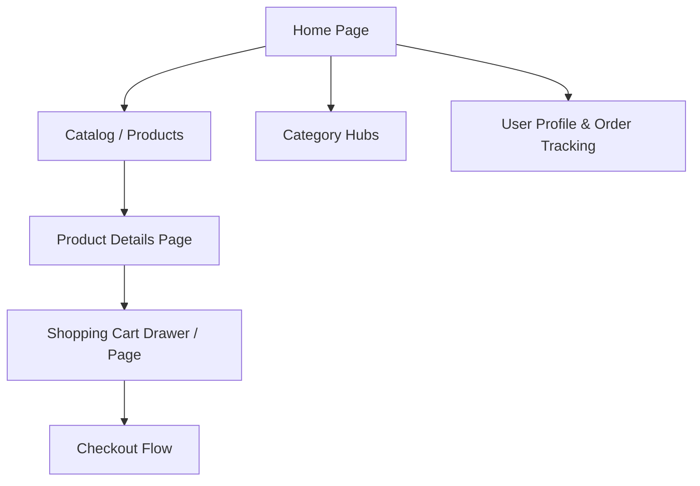

# 🛍️ CartNest — Frontend Architecture & Design Context

> **Brand Vision**: *Where modern elegance meets effortless shopping.*  
> **Target Aesthetic**: Premium, clean, trustworthy, and luminous.  
> **Signature Palette**: Deep Indigo & Crisp White accented with Luminous Teal.

---

## 1. Brand Identity & Emotional Design

### Brand Personality
- **Core Archetype**: The Refined Curator (Sophisticated, dependable, frictionless, and forward-thinking).
- **Tone of Voice**: Clear, inviting, reassuring, and premium.
- **User Emotion Goals**:
  - **First 3 Seconds**: A sense of calm luxury, visual clarity, and prestige (no visual clutter or aggressive sales popups).
  - **Browsing**: Delight through fluid micro-interactions, silky smooth hover states, and clear visual hierarchy.
  - **Purchasing**: Unshakable trust and confidence through secure authentication, crisp transparent pricing, and instant feedback.

---

## 2. Color Palette & Design Tokens

A curated, harmonious palette blending the depth of Indigo, the purity of White/Slate, and the vibrant vitality of Teal.

```
┌─────────────────────────────────────────────────────────────────────────────┐
│                             PRIMARY PALETTE                                 │
│                                                                             │
│  [ Deep Void ]    [ Royal Indigo ]   [ Luminous Teal ]   [ Soft Surface ]   │
│    #0F172A            #4338CA            #0D9488             #F8FAFC        │
│   slate-900          indigo-700          teal-600           slate-50        │
└─────────────────────────────────────────────────────────────────────────────┘
```

### Color Token Reference

| Role | Color Name | Hex Code | Tailwind v4 Token / Class | Usage |
| :--- | :--- | :--- | :--- | :--- |
| **Primary Base** | Deep Indigo | `#1E1B4B` | `indigo-950` | High-contrast headers, luxury accents, dark badges |
| **Primary Brand** | Royal Indigo | `#4338CA` | `indigo-700` | Main brand identity, key CTA buttons, active links |
| **Primary Light** | Electric Indigo | `#6366F1` | `indigo-500` | Hover states, glowing gradients, subtle borders |
| **Accent Primary** | Sea Luminous Teal | `#0D9488` | `teal-600` | Highlights, promotional chips, primary action sparks |
| **Accent Glow** | Bright Teal | `#14B8A6` | `teal-500` | Button hover glow, notification dots, success badges |
| **Accent Soft** | Ice Teal | `#CCFBF1` | `teal-50` / `teal-100` | Tag backgrounds, subtle pill highlights |
| **Background Main** | Pure Canvas | `#FFFFFF` | `bg-white` | Product cards, modals, content surfaces |
| **Background Subtle**| Pearl Gray | `#F8FAFC` | `bg-slate-50` | App background, section alternating bands |
| **Border & Divider**| Crisp Frost | `#E2E8F0` | `border-slate-200` | Clean dividers, card borders, subtle separators |
| **Text Primary** | Midnight Slate | `#0F172A` | `text-slate-900` | Headlines, product titles, bold prices |
| **Text Secondary** | Muted Slate | `#475569` | `text-slate-600` | Body copy, descriptions, secondary metadata |
| **Text Tertiary** | Light Fog | `#94A3B8` | `text-slate-400` | Captions, disabled states, placeholder text |

### Gradient Presets
- **Hero Glow**: `bg-gradient-to-br from-indigo-900 via-indigo-800 to-teal-900`
- **Primary CTA**: `bg-gradient-to-r from-indigo-600 via-indigo-700 to-teal-600 hover:from-indigo-500 hover:to-teal-500`
- **Soft Ambient Card**: `bg-gradient-to-b from-white to-slate-50/50`
- **Text Gradient**: `bg-gradient-to-r from-indigo-600 to-teal-600 bg-clip-text text-transparent`

---

## 3. Typography & Hierarchy System

- **Primary Headings & Display**: *Outfit* or *Plus Jakarta Sans* (Contemporary geometric sans, polished kerning).
- **Body & Controls**: *Inter* or System Font Stack (`font-sans`).

```
Display Large   : text-4xl sm:text-6xl font-extrabold tracking-tight (Hero Title)
Section Title   : text-2xl sm:text-3xl font-bold tracking-tight text-slate-900
Card Headline   : text-lg font-semibold text-slate-900 line-clamp-1
Price Display   : text-xl font-bold text-indigo-700
Meta / Badges   : text-xs font-semibold uppercase tracking-wider
Body Text       : text-base leading-relaxed text-slate-600
```

---

## 4. Spacing, Depth & Elevation System

### Generous Breathing Room
- Avoid dense walls of content. Sections should use `py-16 sm:py-24`.
- Grid containers use `max-w-7xl mx-auto px-4 sm:px-6 lg:px-8`.
- Component padding uses `p-6` or `p-8` for spacious, high-end feel.

### Depth & Glassmorphism Tokens
- **Navbar Glass**: `backdrop-blur-md bg-white/80 border-b border-slate-100 shadow-sm`
- **Card Default**: `bg-white rounded-2xl border border-slate-150 shadow-sm hover:shadow-xl hover:-translate-y-1 transition-all duration-300`
- **Teal Ambient Glow**: `shadow-[0_0_40px_-15px_rgba(20,184,166,0.3)]`
- **Indigo Glow**: `shadow-[0_0_50px_-15px_rgba(79,70,229,0.35)]`

---

## 5. Component Design Standards

### Navigation Bar (`NavBar.jsx`)
- **Structure**:
  - Left: **CartNest** brand logo with an indigo-to-teal gradient spark/icon.
  - Center: Clean navigation links (`Products`, `Categories`, `Deals`, `About`) with animated underline/hover pills.
  - Right:
    - Live Search input / Quick Trigger icon.
    - Cart Button with a floating teal item count badge (`bg-teal-500 text-white text-xs font-bold rounded-full`).
    - User Authentication:
      - When **Signed In**: User avatar (`<UserButton />`) with customized Clerk popover theme.
      - When **Signed Out**: Clean secondary "Sign In" link + gradient primary "Sign Up" button.

### Product Card (`ProductCard.jsx`)
- 1:1 or 4:5 image container with rounded corners (`rounded-xl overflow-hidden bg-slate-100`).
- Subtle zoom effect on product image hover (`group-hover:scale-105 transition-transform duration-500`).
- Category pill badge in soft teal (`bg-teal-50 text-teal-700 text-xs font-medium px-2.5 py-0.5 rounded-full`).
- Bold price display alongside old strikethrough price.
- Quick "Add to Cart" button in Royal Indigo with hover lift and teal accent.

### Action Buttons
- **Primary**: `bg-indigo-600 hover:bg-indigo-700 text-white font-medium px-5 py-2.5 rounded-xl shadow-md shadow-indigo-200 hover:shadow-indigo-300 transition-all active:scale-[0.98]`
- **Secondary / Ghost**: `bg-white hover:bg-slate-50 text-slate-700 border border-slate-200 font-medium px-5 py-2.5 rounded-xl transition-all`
- **Accent (Teal)**: `bg-teal-600 hover:bg-teal-500 text-white font-medium px-5 py-2.5 rounded-xl shadow-md shadow-teal-100 transition-all`

### Footer (`Footer.jsx`)
- Multi-column layout on deep indigo / slate background (`bg-slate-900 text-slate-400`).
- Brand narrative, curated collection links, customer support, trust/security badges (SSL, 30-day money-back guarantee), social links, and newsletter subscription form.

---

## 6. Page Structure & User Journey



1. **Home (`/`)**:
   - **Hero Section**: High-impact editorial headline, subheadline, dual CTAs ("Explore Collection" + "New Arrivals"), ambient indigo-teal backdrop visual.
   - **Value Proposition Bar**: 4 pillars (Free Global Delivery, 24/7 Concierge Support, 100% Authentic, Secure Checkout).
   - **Featured Categories**: Visual tiles with smooth hover zooms.
   - **Trending / Best Sellers Grid**: Dynamic product cards with rating stars.
   - **Promo Spotlight Banner**: Indigo gradient card showcasing seasonal discounts.
   - **Customer Reviews**: Testimonial carousel/grid with real customer trust signals.
2. **Products Catalog (`/products`)**:
   - Category filtering (Electronics, Fashion, Home & Living, etc.).
   - Price range slider, sorting (Price, Newest, Popularity), search bar.
   - Responsive multi-column grid (1 col mobile, 2 col tablet, 4 col desktop).
3. **Product Detail (`/products/:id`)**:
   - High-resolution gallery with thumbnail switcher.
   - Variant selectors (Color, Size, Quantity counter).
   - Sticky Add to Cart & Buy Now action strip.
   - Full specs, tabbed descriptions, and verified customer reviews.
4. **Cart (`/cart`)**:
   - Real-time price breakdown (Subtotal, Estimated Tax, Shipping, Total).
   - Quantity modifiers with instant feedback.
   - Promo code input with instant validation.
   - 1-Click checkout button leading to payment.
5. **Profile / Orders (`/profile`)**:
   - Clerk user management integration.
   - Order history status pills (Processing, Shipped, Delivered).
   - Saved shipping addresses.

---

## 7. Technical Stack & Architecture

- **Build Tool**: Vite 8 with Hot Module Replacement (HMR).
- **UI Library**: React 19 (`react`, `react-dom`).
- **Styling**: Tailwind CSS v4 (`@tailwindcss/vite`, `@import "tailwindcss"`).
- **Authentication**: `@clerk/react` (Protected routes, session tokens, user profiles).
- **Icons**: `lucide-react` (Crisp, consistent stroke width icons).
- **Routing**: `react-router-dom` v7.
- **Backend API**: Node.js / Express on `http://localhost:5000/api/v1`
  - `/users` — Profile sync and preferences.
  - `/products` — Product catalog, stock, and search.
  - `/categories` — Taxonomy and grouping.
  - `/orders` — Order creation and tracking.

---

## 8. Frontend Quality & Accessibility Rules

- **Contrast Compliance**: All text combinations meet WCAG AA (minimum 4.5:1 ratio for regular text, 3:1 for large text).
- **Semantic Structure**: Always use semantic tags (`<header>`, `<nav>`, `<main>`, `<section>`, `<article>`, `<footer>`).
- **Layout Stability**: Reserve space for dynamic images to eliminate Cumulative Layout Shift (CLS).
- **Keyboard Navigation**: Clear `:focus-visible` ring indicators (`ring-2 ring-indigo-500 ring-offset-2`).
- **Mobile First**: Fluid responsiveness designed from 360px up to 4K displays.
